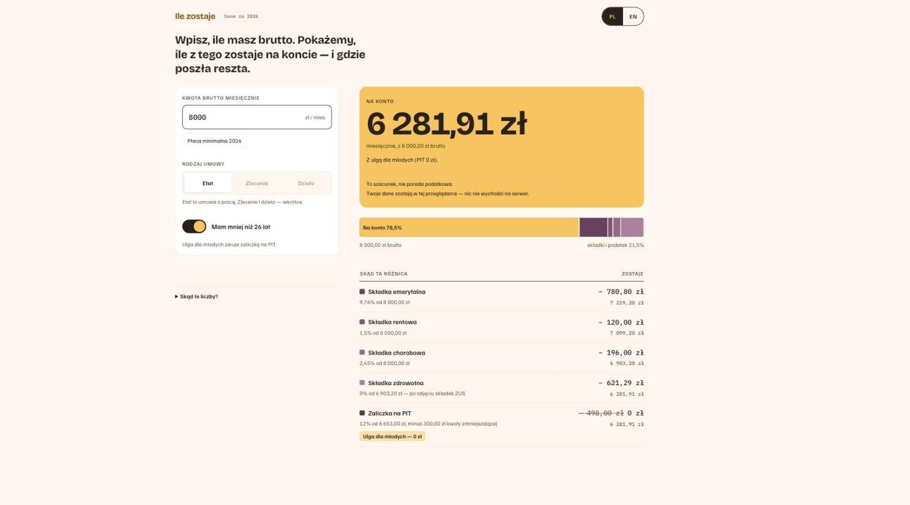

<h1 align="center">Ile zostaje</h1>

<p align="center">
  <strong>Wpisujesz, ile masz brutto. Widzisz, ile naprawdę wpłynie na konto.</strong><br />
  Albo odwrotnie: mówisz, ile chcesz mieć na koncie, a dostajesz kwotę na umowę.<br />
  W godzinach, tygodniach, miesiącach albo latach — tak, jak podano Ci stawkę.<br />
  Kalkulator wynagrodzeń dla młodych i studentów w Polsce.
</p>

<p align="center">
  
  
  
  
  
</p>

---

## Problem

Dostajesz ofertę: **8 000 zł brutto**. I dalej nie wiesz, czy Cię na to stać.

Bo brutto to nie jest liczba, którą wydajesz. Między nią a Twoim kontem stoją cztery
składki i zaliczka na podatek, każda liczona od innej podstawy, w określonej kolejności.
Jeśli masz mniej niż 26 lat, jedna z nich znika. Jeśli jesteś studentem na zleceniu,
znika ich znacznie więcej. Kalkulatory w sieci albo o to nie pytają, albo pytają
o wszystko naraz i pokazują tabelę, której nikt nie czyta.

Ten projekt odpowiada na jedno pytanie: **ile realnie zostaje mi w kieszeni co miesiąc** —
a potem ile z tego zostaje, kiedy zapłacisz czynsz i kupisz jedzenie.

---

<p align="center">
  
</p>

---

## Jak to czytać

Ekran nie zaczyna od tabeli. Zaczyna od **jednej liczby** — tej, która wpłynie na konto.
Reszta tłumaczy, skąd się wzięła różnica.

**Pasmo** pokazuje proporcję. Jego szerokość *jest* Twoim brutto, więc to, że kawałki
sumują się do całości, jest faktem geometrycznym, a nie obietnicą.

**Drabina** odejmuje po kolei, z bieżącą resztą po prawej — bo polska lista płac naprawdę
liczy się sekwencyjnie, a nie jako worek procentów. Przy 8 000 zł brutto na etacie:

| Krok | Ile | Zostaje |
| --- | ---: | ---: |
| Brutto | | **8 000,00 zł** |
| Składka emerytalna — 9,76% od 8 000,00 zł | − 780,80 zł | 7 219,20 zł |
| Składka rentowa — 1,5% od 8 000,00 zł | − 120,00 zł | 7 099,20 zł |
| Składka chorobowa — 2,45% od 8 000,00 zł | − 196,00 zł | 6 903,20 zł |
| Składka zdrowotna — 9% od 6 903,20 zł, po odjęciu ZUS | − 621,29 zł | 6 281,91 zł |
| Zaliczka na PIT — 12% od 6 653,00 zł, minus 300,00 zł kwoty zmniejszającej | − 498,00 zł | **5 783,91 zł** |

Włącz **„mam mniej niż 26 lat"** i ostatnia linia znika: PIT spada do zera, a na konto
wpływa **6 281,91 zł**. To jest 498 zł miesięcznie różnicy, o której wiele osób w tym
wieku po prostu nie wie.

---

## W drugą stronę

Rozmowa o pracę rzadko zaczyna się od brutto. Zaczyna się od „potrzebuję 5 000 zł na
życie". Przełącznik **kierunku** nad polem odwraca pytanie: wpisujesz kwotę, która ma
wpłynąć na konto, a aplikacja podaje brutto, które ją produkuje. Od `v0.5.0` jest to jeden
przycisk, który mówi, co liczysz **teraz** — klikasz i napis się odwraca.

Nie jest to mnożnik ani drugi wzór. Odpowiedź jest **wyszukiwana przez ten sam silnik**,
który liczy w drugą stronę — więc nie może się z nim rozjechać. Rozbicie, pasmo i drabina
pod spodem są co do grosza tym samym ekranem, co przy wpisaniu tego brutto ręcznie.

I jedna rzecz, którą inne kalkulatory przemilczają: **netto nie rośnie równo z brutto.**
Zaokrąglenia podstaw sprawiają, że na odcinku 5 000–5 300 zł brutto na etacie netto
*spada* przy 118 krokach o grosz, a to samo netto potrafi wyjść z kilku różnych brutto.
Przy 4 600 zł na konto (etat) pasuje pięć wartości — 6 263,06, 6 263,08, 6 264,33,
6 264,34 i 6 264,35 zł — i nie jest to ciągły przedział, tylko pięć osobnych kwot.
Aplikacja pokazuje **najniższą** i mówi wprost, że jest ich więcej, zamiast udawać,
że odpowiedź jest jedna.

---

## W jednostce, w której Ci to powiedziano

Ogłoszenia nie mówią jednym językiem. „35 zł/h", „4 500 na rękę", „90 tysięcy rocznie" —
i to Ty masz to przeliczyć, zanim w ogóle zaczniesz porównywać. Od `v0.4.0` nie musisz:
jednostka siedzi w samym polu kwoty, tam gdzie wcześniej stał nieedytowalny napis
`zł / mies.`, który zresztą był po prostu nieprawdą dla połowy ofert.

Wielka liczba zawsze zostaje **miesięczna** — bo miesięczny jest czynsz, miesięczne są
progi podatkowe i miesięczne będzie to, co zostaje po jedzeniu. Pod nią stoi drobna linia
w Twojej jednostce: `≈ 25,72 zł na konto za godzinę`.

**A teraz rzecz, której ten kalkulator nie zrobi.** Nie powie Ci, ile godzin ma miesiąc,
bo w Polsce nie ma takiej liczby — nominalny miesiąc według Kodeksu pracy waha się w 2026
mniej więcej między 152 a 184 godzinami. Sztywne 168 jest zmyślone. Sztywne 173⅓ da się
wyprowadzić z 40-godzinnego tygodnia, ale dla studenta pracującego 20 godzin tygodniowo
jest po prostu fałszem o jego własnej wypłacie. Więc aplikacja **pyta**, ile godzin
tygodniowo pracujesz, i drukuje pod polem samo działanie:

> `40 godz. tygodniowo × 52 tyg. ÷ 12 miesięcy.`

Nie `173,33 godz. miesięcznie` — bo kto by to pomnożył, wyszedłby 12 groszy obok wyniku,
który widzi na ekranie. Działanie da się odtworzyć. Zaokrąglony półprodukt da się tylko
przyjąć na wiarę.

Przy okazji doszedł **roczny limit 30-krotności**: powyżej 23 550 zł miesięcznie składka
emerytalna i rentowa przestają rosnąć, a drabina sama zaczyna pisać `9,76% od 23 550,00 zł`
zamiast od Twojego brutto. Liczba jest odczytana z zus.pl, z datą i sygnaturą `MP 2025.1206`.

---

## Zasady, na których to stoi

**Twoje dane nie opuszczają przeglądarki.** Nie ma serwera, konta, logowania ani analityki.
To, co wpiszesz, siedzi w `localStorage` Twojej przeglądarki i nigdzie indziej — a interfejs
mówi Ci to wprost, zamiast liczyć na to, że przeczytasz politykę prywatności.

**Każda stawka ma cytowane źródło urzędowe.** Nie „9,76% bo tak" — tylko 9,76% z datą
wejścia w życie i linkiem do ZUS albo podatki.gov.pl, rozwijalnym na ekranie. Stawka,
której nie da się ocytować, nie wchodzi do aplikacji.

**Rok podatkowy jest danymi, nie kodem.** Stawki żyją w pliku danych z kluczem roku.
Reguła podatkowa zaszyta w gałęzi `if` jest w tym projekcie traktowana jako defekt,
a nie jako skrót — bo przepisy zmieniają się co roku, a kod przepisany na kolanie w grudniu
jest tym, co psuje takie kalkulatory.

**To jest szacunek, nie porada podatkowa.** Ekran mówi to sam. Nie zastąpi księgowej,
nie złoży PIT-u i nie jest niczym, co urząd potraktuje jako wiążące.

---

## Co działa dzisiaj

| | Stan |
| --- | --- |
| **Umowa o pracę** — brutto → netto, pełne rozbicie | ✅ `v0.1.0` |
| **Ulga dla młodych** (do 26 lat) | ✅ `v0.1.0` |
| **Polski i angielski**, cały interfejs | ✅ `v0.1.0` |
| **Dane w localStorage**, przeżywają przeładowanie | ✅ `v0.1.0` |
| **Źródła z datami wejścia w życie** | ✅ `v0.1.0` |
| **Umowa zlecenie** — własne zasady ZUS, pełne rozbicie | ✅ `v0.2.0` |
| **Student do 26 lat na zleceniu** — bez ZUS, wszystkie składki znikają | ✅ `v0.2.0` |
| **Umowa o dzieło** — bez ZUS i bez zdrowotnej, koszty 20% albo 50% | ✅ `v0.2.0` |
| **Ulga dla młodych tylko tam, gdzie sięga** — ekran mówi, gdzie nie sięga | ✅ `v0.2.0` |
| **Przeliczanie netto → brutto** — przez ten sam silnik, nie przez mnożnik | ✅ `v0.3.0` |
| **Uczciwość przy wielu odpowiedziach** — ekran mówi, że brutto jest więcej niż jedno | ✅ `v0.3.0` |
| **Jednostki: godzina, tydzień, miesiąc, rok** — kwota z ogłoszenia, nie przeliczona | ✅ `v0.4.0` |
| **Roczny limit 30-krotności ZUS** — powyżej 23 550 zł/mies. składki znikają | ✅ `v0.4.0` |
| **Jeden przełącznik kierunku** — pokazuje, co liczysz teraz, klik odwraca | ✅ `v0.5.0` |
| **Działa od pierwszej sekundy** — przykładowe 5000 zł, jeden klawisz i jest Twoje | ✅ `v0.5.0` |
| **Ile zostaje po czynszu i jedzeniu** | 📋 zaplanowane |
| Publiczny adres | 📋 zaplanowane |

Tabela jest szczera celowo. Dopóki ostatnia warstwa nie powstanie, to jest kalkulator
netto — a sam kalkulator netto to towar, którego w sieci jest sto.

**Poza zakresem, świadomie:** B2B i działalność gospodarcza, składanie PIT-u, konta
użytkowników, jakikolwiek rok podatkowy poza tym, który jest w danych.

---

## Uruchomienie lokalnie

Potrzebujesz Node 20.19+ albo 22.12+ (wymóg Vite 7) i npm. Budowane i sprawdzane
na Node 25.9.0.

```bash
git clone https://github.com/mjgromek/ile-zostaje.git
cd ile-zostaje
npm install
npm run dev
```

Aplikacja stanie na `http://localhost:5173`.

```bash
npm test        # silnik: przypadki liczone ręcznie, z podanym źródłem każdej liczby
npm run e2e     # prawdziwa przeglądarka, przez Playwright
npm run build   # produkcyjny build
```

**`npm run e2e` nie jest opcjonalny.** Bramka bezpieczeństwa `v0.4.0` zepsuła celowo
kontrolę zakresu kwoty i wszystkie 39 testów silnika przeszło na zielono — złapała to
dopiero przeglądarka. Samo `npm test` potrafi zaraportować zdrowie zepsutej bramki
wejścia.

---

## Jak to jest zbudowane

TypeScript, Vite, React. Bez frameworka do stanu, bez backendu, bez zależności, które
nie zarobiły na swoje miejsce.

```
src/engine/       silnik liczący — czysty, bez UI
src/engine/rates-2026.ts   stawki na rok, każda ze źródłem i datą
src/engine/solve.ts        odwrotność silnika, szukana jego własnymi wywołaniami
src/state/units.ts         godzina/tydzień/rok → miesiąc, jedno zaokrąglenie
src/i18n/         wszystkie napisy, PL i EN
src/components/   pasmo, drabina, karta wejścia, panel źródeł
src/state/        localStorage i nic poza nim
e2e/              testy w prawdziwej przeglądarce
```

Silnik nie wie nic o interfejsie, a interfejs nie liczy podatków. Dzięki temu przypadki
testowe da się policzyć ręcznie na kartce i porównać co do grosza — i tak właśnie są
sprawdzane.

---

## Jak to powstaje

Projekt jest budowany pipeline'em agentowym
[EasyDev](https://github.com/mjgromek/easydev-agentic-pipeline): sekwencjonowanie
i cięcie na pionowe kawałki, budowa test-first, niezależna weryfikacja na żywej aplikacji,
i eskalacja do człowieka tylko tam, gdzie decyzja naprawdę jest jego.

Dwie zasady stamtąd widać w tym repozytorium gołym okiem:

- **Recenzent uruchamia produkt, nie czyta diffa.** Każdy kawałek jest sprawdzany
  w prawdziwej przeglądarce — liczby są dodawane ręcznie i porównywane z tym, co widać
  na ekranie. „Testy przechodzą" jest tu odrzucaną odpowiedzią.
- **Zanim uwierzysz obserwacji, sprawdź przyrząd.** Defekty samego pipeline'u są
  zapisywane osobno, w `RUN-004-FINDINGS.md`, razem z tym, czym je zmierzono. W tym
  przebiegu trzy różne narzędzia zaraportowały stan, którego nie miały — każde z nich
  o mało nie wyprodukowało błędu w produkcie, którego tam nie było.

Dokumentacja szablonu, na którym to stoi, została w `docs/`.

---

## Licencja

MIT — [`LICENSE`](LICENSE).

Stawki i progi pochodzą z publicznych materiałów ZUS i Ministerstwa Finansów; każda
pozycja ma link i datę w panelu „Skąd te liczby?" w aplikacji.

---

<p align="center">
  <sub><strong>Ile zostaje</strong> · wynik jest szacunkiem, nie poradą podatkową</sub>
</p>

---

<details>
<summary><strong>English</strong></summary>

<br />

**Ile zostaje** ("what's left") is a salary calculator for young people and students in
Poland. You enter your gross pay and your contract type, and it shows the real amount that
reaches your bank account — then, once that layer ships, what remains after rent and food.

**Why it exists.** Gross pay is not the number you spend. Four separate contributions and
an income-tax advance sit between the two, each computed on a different base, in a fixed
order. Under 26, one of them disappears. A student on a *umowa zlecenie* loses far more
than that. Most calculators either never ask, or ask everything at once and print a table
nobody reads.

**Principles.** Your data never leaves the browser — no backend, no account, no analytics;
entries live in `localStorage` and the interface says so. Every rate carries a cited
official source with an effective date, and a rate that cannot be cited does not ship. The
tax year is data, not code: a rule buried in an `if` branch is treated as a defect. The
result is an estimate, not tax advice.

**Today** (`v0.5.0`): all three contracts — employment (*umowa o pracę*), *umowa zlecenie*
with its own ZUS rules, and *umowa o dzieło* with no ZUS, no health contribution and
deductible costs at 20% or 50% where copyright transfers, capped annually. A student under
26 on a *zlecenie* pays no ZUS at all, and every contribution line disappears from the
screen. The under-26 income-tax relief applies only to the contracts the cited source
lists, and where it does not reach, the interface says so instead of ignoring the control.
Plus, from `v0.1.0`: the under-26 relief, a full Polish and English interface, localStorage
persistence and cited sources with effective dates. New in `v0.3.0`: a **direction toggle** —
name the amount you want to land on and get the gross pay that produces it. The inverse is
searched through the same engine rather than approximated by a multiplier, and because net
is not monotone in gross, where several gross figures yield the entered net the app shows
the lowest and says so on screen. New in `v0.4.0`: **input units** — hour, week, month or
year, picked inside the amount field itself. The headline figure stays monthly whatever you
type, with a smaller per-unit echo beneath it. The app refuses to invent an hours-per-month
constant — Poland has no fixed one — so the hour unit asks how many hours a week you work
and prints the operation (`40 h a week × 52 weeks ÷ 12 months`) rather than a rounded
intermediate you could not reproduce. The annual ZUS contribution ceiling (*limit
30-krotności*) ships with it, read off zus.pl with its effective date. **Planned:** the
rent-and-food leftover layer, and a public URL.

Run it with `npm install && npm run dev`. Tests: `npm test` for the engine,
`npm run e2e` for a real browser.

</details>
