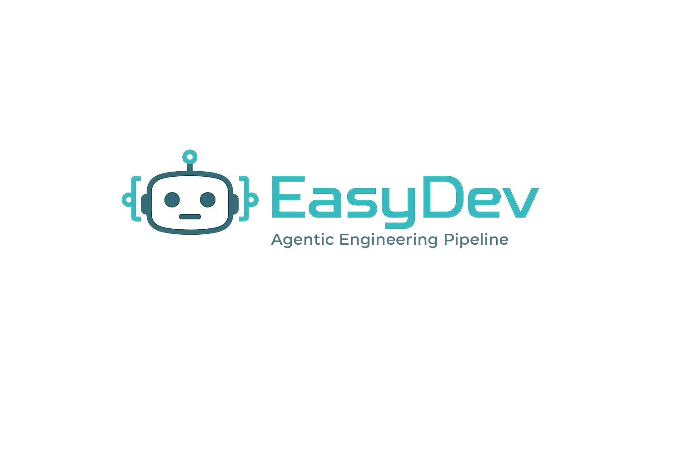
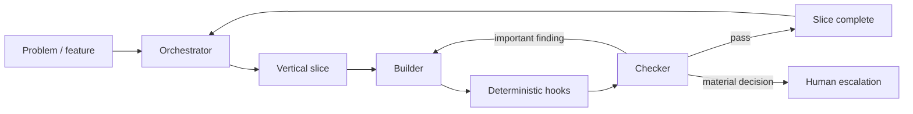

<p align="center">
  
</p>

<p align="center">
  <strong>A bounded-autonomy engineering pipeline for Claude Code.</strong><br />
  Plan → Build → Review → Verify → Ship.
</p>

<p align="center">
  
  
  
  
  
</p>

<p align="center">
  You describe the problem. EasyDev turns it into vertical slices, delegates implementation,
  independently checks the result, and interrupts you only when a decision genuinely needs a human.
</p>

---

## Why EasyDev exists

AI coding agents can produce a lot of code quickly. The harder problem is making sure they do the **right work**, verify it independently, avoid silent failures, and know when to stop and ask.

EasyDev was designed around failures observed in a real project:

- features reported as complete even though they did not exist;
- green test suites that missed a serious session-security flaw;
- findings produced by unverified measurement tools;
- scripted edits that exited successfully while changing nothing;
- repeated design reversals because decisions were not recorded;
- stale deployments that passed a health check from the wrong revision.

The result is intentionally small: **4 agents, 8 skills, 4 deterministic hooks, and an explicit autonomy policy**.

> EasyDev is not trying to replace engineering judgment. It is trying to spend that judgment only where it matters.

---

## How it works



EasyDev separates responsibilities so the same agent does not quietly implement, review, and approve its own work.

| Layer | Responsibility | Key constraint |
| --- | --- | --- |
| **Orchestrator** | Sequencing, slicing, state, delegation, summaries | Does not write product code or tests |
| **Designer** | Interface form, then aesthetic direction, as one proposal | Read-only; cannot implement what it proposes |
| **Builder** | Implements one vertical slice end-to-end | Cannot declare its own slice complete; does not choose form |
| **Checker** | Reviews acceptance criteria and exercises the artifact | Read-only; cannot fix what it reviews |
| **Hooks** | Enforce deterministic rules outside the model | Fail closed when an invariant is violated |
| **Human** | High-impact decisions only | Not used for routine implementation choices |

---

## Quick start

```bash
git clone https://github.com/mjgromek/easydev-agentic-pipeline.git my-project
cd my-project

git config core.hooksPath hooks
claude
```

### 1. Start Claude Code inside the clone

The session working directory must be **inside the repository**. Claude Code enumerates agents and skills when the session starts.

If the session starts one directory above the clone, `.claude/` will not be loaded and the custom agents/skills may appear to be missing. Definitions added after a session begins also require a restart.

### 2. Run the preflight check

Before any project work, confirm the available agent types include:

```text
orchestrator
builder
checker
```

If they are missing, restart Claude Code from inside the repository.

### 3. Wire the Git hooks

```bash
git config core.hooksPath hooks
```

A clone does not configure `core.hooksPath` automatically.

### 4. Start with the orchestrator

Ask the orchestrator to inspect the repository and state the next action. It should own sequencing from that point onward.

---

## The development loop

Each phase is a **vertical slice**: something small enough to build and verify end-to-end, but meaningful enough to produce user-visible or system-visible value.

```text
Discover
   ↓
Slice
   ↓
Build with tests
   ↓
Run deterministic checks
   ↓
Independent review + artifact verification
   ↓
Fix important findings (bounded loop)
   ↓
Record decisions
   ↓
Ship / continue
```

A completed slice produces a compact report rather than a long transcript:

```text
━━━━━━━━━━━━━━━━━━━━━━━━━━━━━━━━━━━━━━━━━━━━━━━━━━
✅  SLICE 3 COMPLETE — Warranty Tracker
━━━━━━━━━━━━━━━━━━━━━━━━━━━━━━━━━━━━━━━━━━━━━━━━━━

🎁 WHAT YOU CAN DO NOW
   Add an appliance and see how much cover is left.

🔍 HOW I KNOW IT WORKS
   Added "Fridge", restarted the app, and confirmed persistence.

📝 FILES CHANGED
   src/warranty/models.py
   src/warranty/cli.py
   tests/test_models.py

⚙️  DECIDED     Dates stored as ISO strings
📥 DEFERRED    CSV import
🙋 NEEDS YOU   Nothing
➡️  NEXT        Warn 30 days before expiry
━━━━━━━━━━━━━━━━━━━━━━━━━━━━━━━━━━━━━━━━━━━━━━━━━━
```

The report must name what was actually exercised. Vague statements such as `all tests pass` are not treated as sufficient evidence.

---

## Agents

| Agent | Owns | Cannot do |
| --- | --- | --- |
| `orchestrator` | Sequencing, slicing, state, delegation, final slice summary | Write product code or tests |
| `designer` | Interface form from the data's shape, then palette and type, as one Level 2 proposal | **Write anything** — it specifies, the builder implements |
| `builder` | One slice end-to-end: failing test first, then minimum implementation | Declare a slice complete; write `.agent/` state; choose the interface's form |
| `checker` | Review against acceptance criteria, then exercise the artifact | **Write anything** — it has no write access |

### Why the checker is read-only

A reviewer that can silently repair the code can also make its own verdict appear correct. EasyDev keeps the checker read-only so its job stays simple: **observe, measure, report**.

---

## Skills

| Skill | Purpose | Hard cap |
| --- | --- | --- |
| `discovery` | One-time intake; creates `PROJECT.md` and the first slice | 5 rounds × 4 questions |
| `grill-me` | Resolves one ambiguity that would otherwise be guessed | 1 round, 3–5 questions |
| `tdd` | Red → green → refactor for the current slice | Acceptance criteria + at most 2 implied guards |
| `ponytail` | Simplicity gate over a diff | One verdict + one-line reason per item |
| `architecture-check` | Boundary/scaling review when module boundaries move | At most 2 `FIX NOW` items |
| `security-gate` | Decides whether the built-in security review is warranted | Risk-triggered; otherwise declines in one line |
| `theme-factory` | Establishes palette and typography once on the real UI | Once per project; max 2 re-render rounds |
| `frontend-design` | Visual direction when UI work is in scope | UI slices only |

The skills are intentionally bounded. They exist to improve decisions, not to create endless analysis loops.

---

## Deterministic hooks

Model instructions are useful. Some rules are important enough to enforce outside the model.

| Hook | Refuses / verifies |
| --- | --- |
| `hooks/pre-commit` | Staged lines matching one of seven secret patterns; a staged `.agent/STATE.md` citing a bare commit SHA that does not resolve, or exceeding its 120-line cap |
| `hooks/commit-msg` | `feat:` / `fix:` without a preceding overlapping `test:`; `feat:` without staged `.agent/DECISIONS.md` |
| `hooks/verify-deploy.sh` | Declaring deploy success before the expected revision is live or when a live assertion fails |
| `hooks/probe.sh` | Silent production regressions between deployments |

The secret check can be intentionally overridden with `--no-verify`. Other gates are designed around explicit postconditions rather than trusting command exit codes alone.

---

## Four guardrails

### 1. The reviewer must exercise the artifact

A diff can look correct while the feature is absent or unreachable. The checker validates the acceptance criteria against the running artifact where possible.

### 2. Verify the instrument before trusting the observation

A test, script, screenshot, metric, or visual check can itself be wrong. Findings should state **how they were measured**.

### 3. Exit code is not proof

A command can exit `0` and still fail to produce the intended state. EasyDev checks the postcondition when the result matters.

### 4. Decisions live in one place

Material project decisions are recorded in `.agent/DECISIONS.md`; a feature commit must stage that record. The goal is to stop already-settled decisions from drifting between slices.

---

## Bounded autonomy

EasyDev uses four autonomy levels.

| Level | Example | Behaviour |
| --- | --- | --- |
| **0 — automatic** | Implementation matching established patterns, tests, docs | Act; report later |
| **1 — do and report** | Small dependency, internal interface change | Act; include in slice summary |
| **2 — propose and wait** | Schema migration, auth change, user-visible design direction | Stop; give one recommendation |
| **3 — explicit approval** | Production deletion, secrets, billing, irreversible effects | Never proceed without a direct yes |

The canonical matrix and escalation format live in `.claude/policies/autonomy.md`, alongside
three companion policies: `summary.md` (the phase report and its refusal conditions),
`findings.md` (how defects in the pipeline itself are recorded), and `progress.md` (the live
board a human can read while a delegated run is still working). Each file declares its own
line cap in its first line, so the number lives with the file it governs.

The intended human interface is simple: **routine decisions disappear; material decisions become explicit**.

---

## Deployment verification

`verify-deploy.sh` and `probe.sh` share assertions through `hooks/lib/live-assertions.sh`.

| Variable | Required | Behaviour if unset |
| --- | --- | --- |
| `BASE_URL` | yes | Fails: nothing can be asserted |
| `PROTECTED_PATH` | yes | Fails: protected-access behavior cannot be verified |
| `HEALTH_PATH` | no | Defaults to `/health` |
| `RESOURCE_PATH` | no | Resource assertion skipped |
| `TEST_USER`, `TEST_PASS` | no | Login/resource assertions skipped |
| `LOGIN_PATH` | no | Login assertion skipped |
| `EXPECTED_REVISION` | `verify-deploy` only | Revision gate skipped |
| `VERSION_PATH` | no | Defaults to `/version` |
| `REVISION_TIMEOUT` | no | Defaults to `120s` |

Example continuous probe:

```sh
*/10 * * * * BASE_URL=https://app.example.com PROTECTED_PATH=/api/me \
  /path/to/hooks/probe.sh >> /var/log/probe.log 2>&1
```

On Railway, `BASE_URL` is the public domain, `EXPECTED_REVISION` can be the deployment SHA, and `PROTECTED_PATH` remains required. The scripts themselves are platform-agnostic and operate against a URL.

---

## What EasyDev deliberately does not do

V0 intentionally excludes:

- branch / pull-request automation;
- MCP servers;
- dashboard or web UI;
- vector memory / embedding stores;
- task queues;
- parallel agent swarms;
- a fourth specialist agent.

Those ideas belong in `.agent/BACKLOG.md` only when a real project demonstrates a concrete need for them.

> **Default rule:** if V0 works without another abstraction, do not add the abstraction.

---

## Current status

**V0 is cut and has now been driven on a real build.**

- The four hooks are covered by **19 fail-on-purpose cases** in `./hooks/test/run-hook-tests.sh`.
- The hook test harness builds throwaway repositories and checks refusal cases against resulting Git state rather than trusting exit codes alone.
- The **builder → checker loop has been run end-to-end**, across multiple slices of a real project, with the checker reproducing each failing test before accepting its fix.
- That validation run produced its own defect log. Nineteen findings against the pipeline itself are recorded in `archiwum ustaleń w mjgromek/easydev-agentic-pipeline`, several of them fixed here; the rest carry an urgency condition in `.agent/BACKLOG.md`.
- The pipeline is therefore evidenced, not production-proven. It has been used, measured, and found to have faults worth writing down.

Run the hook suite with:

```bash
./hooks/test/run-hook-tests.sh
```

The original design specification remains in `docs/DESIGN.md` as a historical record. Runtime behavior is defined by the implementation when the two differ.

---

## Validation roadmap

The next milestone is not more framework work. It is a real project.

```text
V0 pipeline
    ↓
real project using EasyDev
    ↓
measure friction + human interventions
    ↓
fix only demonstrated problems
    ↓
V0.2
```

Useful evidence to collect during validation:

- active human interventions per slice;
- failed review / verification cycles;
- defects caught before release;
- decisions escalated vs handled autonomously;
- cases where the pipeline added unnecessary process.

This is what should decide V1 — not speculative feature ideas.

---

## Design principles

**Small by default.** Four agents are easier to reason about than an agent hierarchy, and the fourth was added only after a run produced a mistake the other three could not catch.

**Independent evidence beats self-report.** The builder is not the verifier.

**Deterministic where possible.** Hooks enforce invariants that should not depend on prompt compliance.

**Escalate impact, not uncertainty.** Reversible implementation details stay autonomous; consequential decisions reach the human.

**Real projects drive the roadmap.** New machinery must earn its place by solving an observed failure mode.

---

## Credits

`tdd` and `grill-me` are adapted from [mattpocock/skills](https://github.com/mattpocock/skills).

`frontend-design` and `theme-factory` are adapted from [anthropics/skills](https://github.com/anthropics/skills).

The `ponytail` simplicity ladder is adapted from [dietrichgebert/ponytail](https://github.com/dietrichgebert/ponytail) (MIT).

Each vendored skill keeps its own license file. These are tightened forks with no automatic update path; upstream fixes do not arrive automatically.

---

<p align="center">
  <strong>EasyDev</strong><br />
  Less prompting. More verified progress.
</p>
